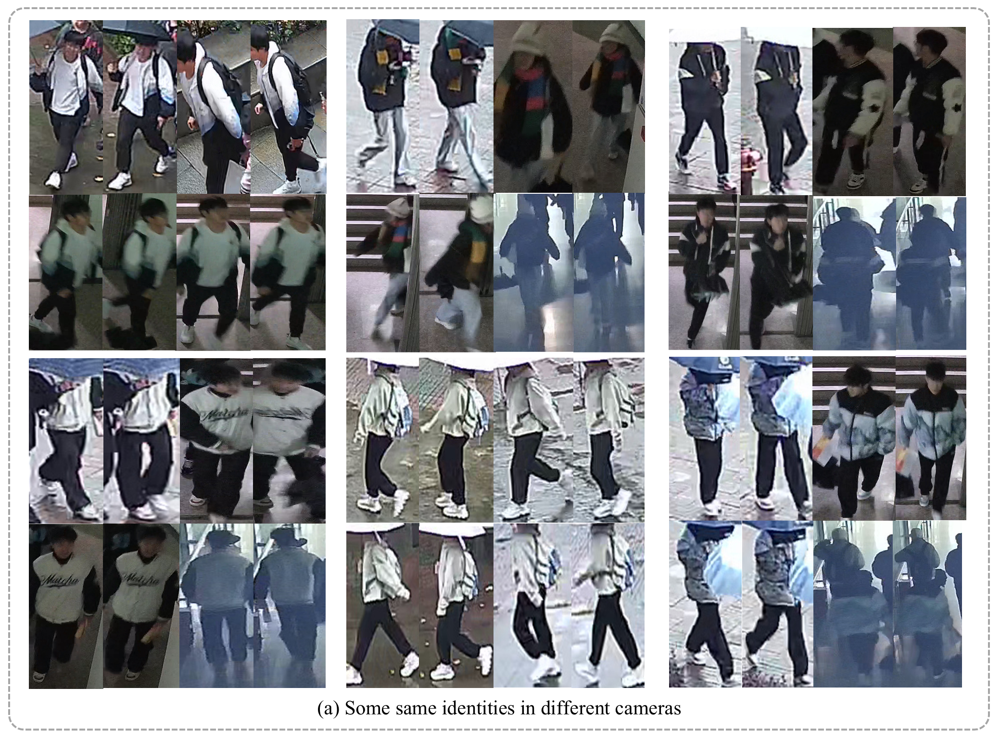

<h1 align="center">RainReID: Person Re-identification in Rainy Weather and a Large-scale Dataset</h1>
<h3 align="center">RainReID Dataset</h3>

<p align="center">
  
</p>

We welcome researchers to explore the **RainReID** dataset for person re-identification under rainy weather conditions.

## 📥 Download

The RainReID dataset can be downloaded from the following link:

**Google Drive:**  
https://drive.google.com/file/d/1c9SoBHI5cEXB8mVP3imRvUP1oqy--uvo/view?usp=drive_link

If you encounter any issues downloading or using the dataset, please contact us at:

**Email:** qingming_leng@jju.edu.cn

---

## 🔒 Privacy Notice

To protect personal privacy, **all visible face regions in the RainReID dataset have been anonymized through face blurring before public release**.

If you identify any remaining privacy-related concerns or have questions regarding the dataset, please contact us via email. We will promptly review and address the issue.

---

## 📖 Citation

If you use the RainReID dataset in your research, please cite our paper:

```bibtex
@article{guo2026rainreid,
  title={RainReID: Person Re-Identification in Rainy Weather and a Large-Scale Dataset},
  author={Guo, Zixie and Xu, Ke and Leng, Qingming},
  journal={IET Computer Vision},
  volume={20},
  number={1},
  pages={e70063},
  year={2026},
  publisher={Wiley Online Library}
}
```
